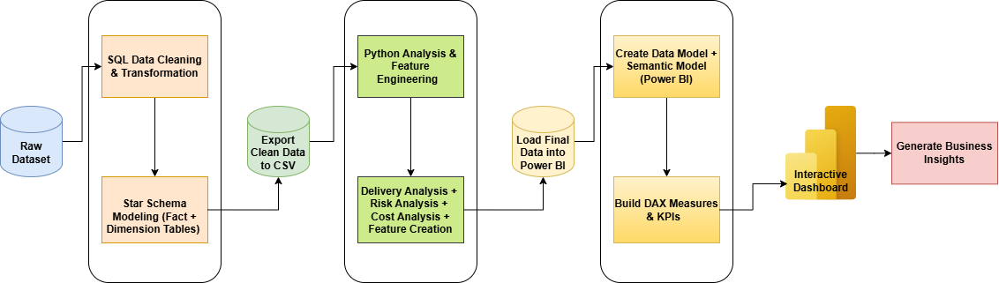

# 🚚 Logistics Intelligence Dashboard

*This dashboard helps logistics teams reduce delivery delay, optimize routes, and control freight cost.*

---

An end-to-end **Business Intelligence project** built with **SQL → Python → Power BI**

---

## 🔗 Live Dashboard

Click here to view the Power BI dashboard:

[View Dashboard](PASTE_YOUR_POWER_BI_LINK_HERE)

---

---

## 📌 Project Overview

This project is a complete **Logistics Intelligence Analytics project**.

I started with raw logistics and delivery data.  
Then I cleaned and joined the data using **SQL Server**.  
After that, I used **Python** to create extra business columns and analytical features.  
Finally, I built a **5-page Power BI dashboard** to analyze delivery performance, delay risk, freight cost, warehouse performance, and route efficiency.

The main goal of this dashboard is to help a logistics company understand:

- How many deliveries were completed
- Which deliveries were late
- Which routes are risky
- Which states and cities have more delay
- How much freight cost is used
- Which warehouses/sellers perform better
- Which package types create more delivery risk

---

## 🗂️ Project Workflow

**Raw Dataset → SQL Cleaning & Joining → Python Feature Engineering → Power BI Dashboard**

---

## 🛤️ Project Roadmap

---

## 🛠️ Tools & Technologies

| Tool | Purpose |
|------|---------|
| SQL Server | Data cleaning, joining, view creation |
| Python | Feature engineering and final CSV creation |
| Power BI | Data modeling, DAX measures, dashboard design |
| Power Query | Small data transformation inside Power BI |
| DAX | KPI measures and business calculations |

---

## 📁 Dataset Tables

The raw dataset included logistics and e-commerce delivery related tables:

- `orders_dataset` — order date, delivered date, estimated date, order status
- `order_items_dataset` — product, seller, price, freight value
- `customers_dataset` — customer city and state
- `sellers_dataset` — seller city and state
- `products_dataset` — product weight and product size
- `geolocation_dataset` — location details

---

## 🔷 Step 1: SQL Work

### What I did in SQL

First, I imported all raw CSV files into SQL Server.

Then I checked:

- Null values
- Wrong date columns
- Missing product details
- Missing seller details
- Missing delivery dates
- Duplicate records
- Join key issues

After checking the data, I created a main SQL view named:

`fact_delivery`

---

## 🧱 SQL View Created

### Main View

- `fact_delivery`

This view was created by joining:

- orders table
- order items table
- customers table
- sellers table
- products table

---

## 📌 Important Columns Created in SQL

The SQL view included these important columns:

- `order_id`
- `customer_id`
- `product_id`
- `seller_id`
- `purchase_date`
- `delivered_date`
- `estimated_date`
- `order_status`
- `price`
- `freight_value`
- `customer_city`
- `customer_state`
- `seller_city`
- `seller_state`
- `product_weight_g`
- `product_length_cm`
- `product_height_cm`
- `product_width_cm`

---

## 🧮 SQL Calculated Columns

I also created delivery related columns:

- `delivery_days`
- `estimated_days`
- `delay_days`
- `delayed_flag`
- `route_name`
- `route_type`
- `delivery_status_bucket`

---

## 🟡 Step 2: Python Work

After SQL work, I exported the cleaned SQL output and used it in Python.

### Main Python Input File

- `fact_delivery.csv`

### Python Output Files

| Output File | Description |
|------------|-------------|
| `fact_delivery_enriched.csv` | Main final fact table with extra delivery features |
| `dim_customer.csv` | Customer city and state dimension |
| `dim_product.csv` | Product weight and size dimension |
| `dim_warehouse.csv` | Seller / warehouse city and state dimension |
| `dim_date.csv` | Date table for Power BI |

---

## 🐍 What I Did in Python

In Python, I created extra useful business columns.

### New Python Columns

- `delivery_speed`
- `delivery_risk_flag`
- `freight_bucket`
- `weight_bucket`
- `size_bucket`
- `volume_cm3`
- `package_density`
- `density_bucket`
- `order_value_bucket`
- `purchase_month`
- `purchase_year`
- `purchase_quarter`

These columns helped me build better visuals in Power BI.

---

## 🧩 Final Data Model

In Power BI, I used a star schema model.

### Fact Table

- `fact_delivery_enriched`

### Dimension Tables

- `dim_customer`
- `dim_product`
- `dim_warehouse`
- `dim_date`

---

## 🔗 Power BI Relationships

Relationships created:

- `dim_customer[customer_id] → fact_delivery_enriched[customer_id]`
- `dim_product[product_id] → fact_delivery_enriched[product_id]`
- `dim_warehouse[seller_id] → fact_delivery_enriched[seller_id]`
- `dim_date[date] → fact_delivery_enriched[purchase_date]`

---

## 📊 DAX Measures Created

Important DAX measures used in the dashboard:

- Total Deliveries
- Delivered Orders
- Delayed Orders
- On-Time Deliveries
- On-Time Delivery %
- Delayed Delivery %
- Average Delivery Days
- Average Delay Days
- Total Freight Cost
- Average Freight Cost
- High Risk Deliveries
- High Risk Delivery %
- Total Order Value
- Average Order Value
- Route Count
- Warehouse Count

---
# 📊 Dashboard Pages

---

## Page 1 — Executive Control Tower

This is the main summary page of the Logistics Intelligence Dashboard.

### Purpose

This page gives a full overview of delivery performance, freight cost, route volume, high-risk deliveries, and high-volume delivery locations.

### KPIs Used

- Total Deliveries
- On-Time %
- Delay %
- Avg Delivery Days
- Freight Cost
- High Risk Deliveries

### Visuals Used

- Monthly Delivery Trend line chart
- Delivery Timing Breakdown donut chart
- Top 10 Routes by Order Volume bar chart
- Cost vs Delay Efficiency by State bubble chart
- High-Volume Delivery Locations by Month heatmap table
- Date slicer
- Customer State slicer
- Route Type slicer

### Business Meaning

This page helps the business quickly understand total delivery performance, delay level, freight cost, top routes, and busiest delivery locations.

---

## Page 2 — Delivery Delay Intelligence

This page focuses on delivery delay patterns across time, route type, shipment speed, and package category.

### Purpose

To understand where delays are happening and which route types or delivery speeds create more delay.

### KPIs / Main Metrics

- Delay Rate
- On-Time Rate
- Cross State Delay %
- Hyper Local Delay %
- Local Delay %

### Visuals Used

- Average Delay Trend Over Time line chart
- Delay % by Route Type column chart
- Delayed Order Distribution decomposition tree
- Monthly Delayed Orders by Status heatmap table
- Delay & Risk Status by Route Type stacked bar chart
- Quarterly Delayed Orders & Delay Rate combo chart
- Delay Rate vs Target gauge
- On-Time Rate vs Target gauge
- Route Type slicer
- Delivery Speed slicer
- Freight Bucket slicer

### Business Meaning

This page helps find the main reasons behind delivery delays.  
It shows that cross-state routes have higher delay percentage than local and hyper-local routes.

---

## Page 3 — Route & Network Performance Analysis

This page focuses on state-to-state delivery movement, route performance, and cost-delay relationship.

### Purpose

To understand which delivery routes are strong, which routes are weak, and how delivery volume changes by route type.

### Visuals Used

- State-to-State Delivery Network Flow matrix
- Route & Location Cost vs Delay bubble chart
- Monthly Deliveries vs Delay Rate combo chart
- Worst Performing Routes bar chart
- Delivery Volume by Route & Freight Type treemap
- Customer State slicer
- Seller State slicer
- Route Type slicer
- Delivery Speed slicer

### Business Meaning

This page helps the logistics team identify top delivery routes, worst performing routes, and high-delay network paths.

---

## Page 4 — Package, Cost & Risk Analysis

This page focuses on package size, package weight, freight cost, and delivery risk.

### Purpose

To understand how package weight, package size, freight cost, and density affect delivery performance.

### KPIs Used

- Cost per Delivery
- Delay Impact Cost
- Operational Risk %
- Critical Risk %
- Avg Package Density
- Heavy Package %

### Visuals Used

- Freight Cost Distribution by Route Type bar chart
- Average Freight Cost by Delivery Speed column chart
- Package Density vs Delivery Cost scatter chart
- Top Critical Routes by Risk & Delay table
- Quarterly Delivery Volume by Package Weight area chart

### Business Meaning

This page helps understand which package types and routes are creating higher cost and higher risk.  
It also shows that cross-state deliveries have the highest freight cost.

---

## Page 5 — Warehouse & Operational Performance

This page focuses on warehouse/seller performance, delivery efficiency, freight cost, early delivery, delay days, and package load.

### Purpose

To monitor warehouse efficiency, seller-state performance, delivery completion rate, and operational trends.

### KPIs Used

- Avg Early Days
- Avg Delay Days:
- Delivery Efficiency
- Delivery Completion Rate
- Avg Freight per Order
- Heavy Load Impact %

### Visuals Used

- Warehouse Performance by Seller State bar chart
- On-Time vs Delayed Deliveries column chart
- Avg Delivery Time Trend Over Time line chart
- Monthly Early vs Delay Days Trend area/line chart
- Avg Package Volume vs Prior Month KPI area visual
- Heavy Package % vs Prior Month KPI area visual
- Package Volume by Size & Weight Class stacked column chart

### Business Meaning

This page helps compare warehouse/seller state performance and understand operational efficiency.  
It shows which seller states handle the most deliveries and how early days, delay days, freight, and heavy package load change over time.

---

## 📸 Dashboard Preview

### 🔹 Executive Control Tower

### 🔹 Delivery Performance Analysis

### 🔹 Route & Location Intelligence

### 🔹 Freight & Package Analysis

### 🔹 Warehouse & Operational Performance

---

## 💡 Key Business Insights

- Some routes have higher delay risk than others.
- Cross-state routes usually take more time than local routes.
- Freight cost changes based on route type, package size, and weight.
- High-risk deliveries should be monitored carefully.
- Some warehouses perform better in delivery speed and delay control.
- Delivery delay can be reduced by improving route planning and warehouse performance.

---

## 🧠 Skills Demonstrated

- SQL data cleaning
- SQL joins and view creation
- Fact and dimension table design
- Python feature engineering
- Power BI star schema modeling
- DAX measure creation
- Interactive dashboard design
- Logistics business analysis
- Data storytelling

---

## ✅ Project Outcome

This project shows a complete real-world analytics pipeline.

I used raw logistics data and converted it into a clean, useful, and interactive dashboard.

The final dashboard can help a business team track:

- Delivery performance
- Delay problems
- Route risk
- Freight cost
- Warehouse performance
- Operational efficiency

---

## 👨‍💻 About Me

**Sayan Naha**

📧 **Email:** snsayan2012@gmail.com  
🔗 **LinkedIn:** [Sayan Naha](https://www.linkedin.com/in/sayan-naha/)

---
